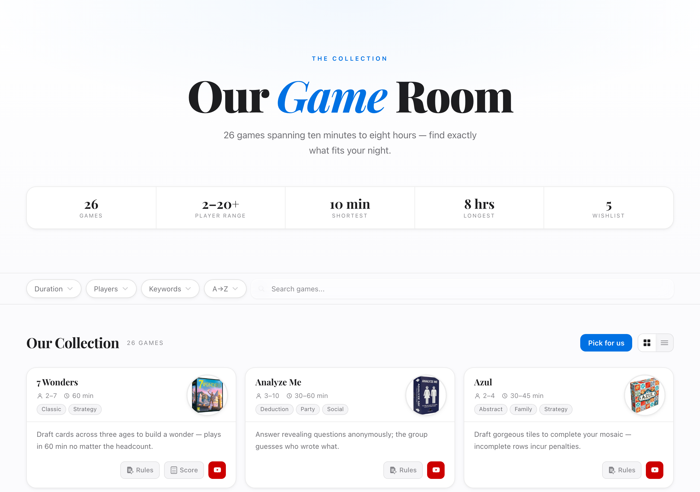
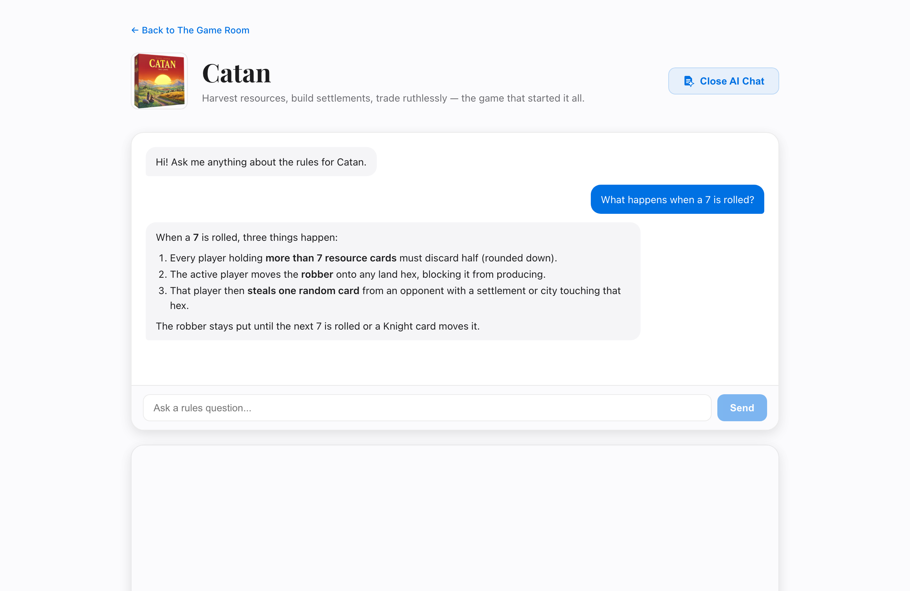
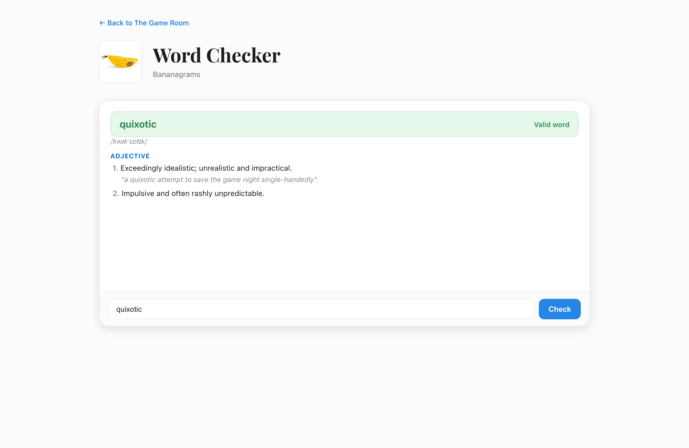
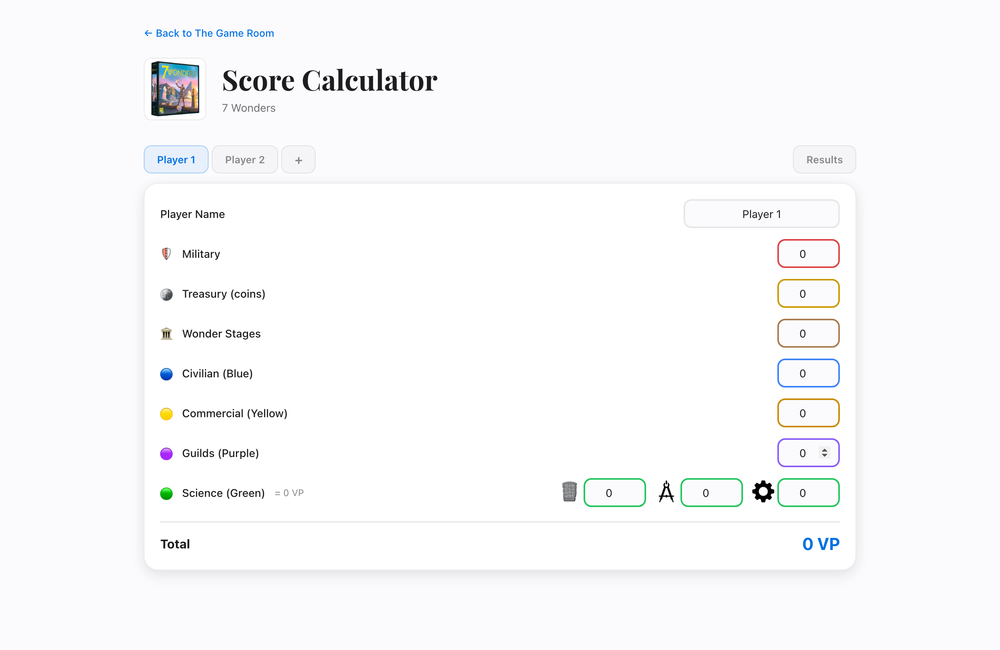
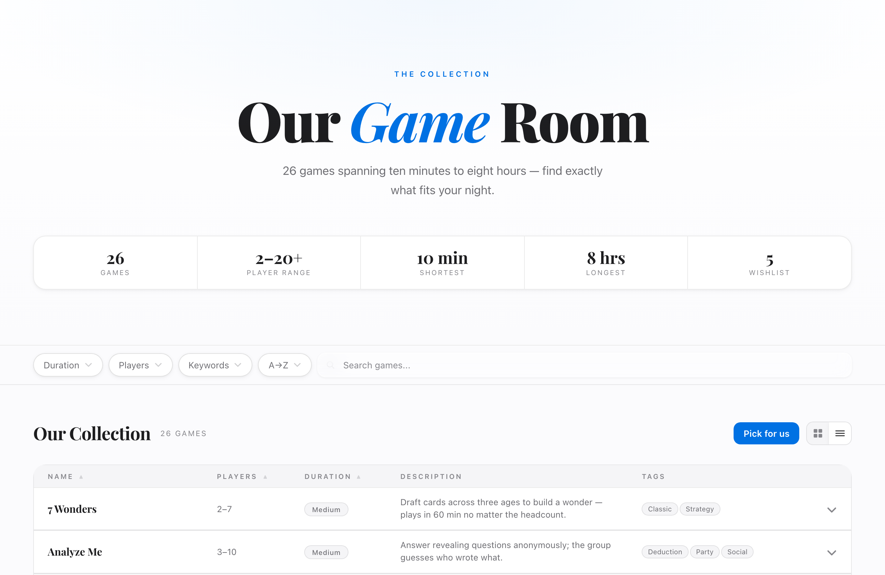

# The Game Room

A single-page web app for browsing a personal board game collection — filter and
sort 26 games by length, player count, and vibe; get a "pick for us" random
suggestion; read bundled rulebooks; ask an **AI rules assistant**; tally a
**7 Wonders** score; check whether a word is playable in **Bananagrams**; and
vote on a shared wishlist.

Built with React 19 + TypeScript on Vite, with a small set of Vercel serverless
functions for the AI and voting features.



## Highlights

- **Fast, shareable filtering.** Duration, player count, and keyword filters plus
  full-text search and multiple sort modes, driven by a `useReducer` store that
  mirrors its state into the URL — so any filtered view can be copied and shared.
- **Grid and list views** over the same 26-game collection, with a one-click
  random "pick for us" suggestion.
- **AI rules assistant.** Each game's rulebook PDF is extracted to text and fed to
  Google Gemini, which answers rules questions grounded only in that game's rules
  and streams the reply token-by-token.
- **7 Wonders score calculator** with the full scoring model, including the
  quadratic science formula.
- **Bananagrams word checker** backed by a public dictionary API.
- **Anonymous wishlist voting** stored in Upstash Redis.
- **Accessibility-tested UI** — `eslint-plugin-jsx-a11y` static checks plus
  `axe-core` assertions on rendered components in CI.

## Screenshots

| AI rules assistant | Word checker | 7 Wonders score calculator |
| --- | --- | --- |
|  |  |  |

A sortable list view is also available:



> The AI-assistant and word-checker screenshots use locally stubbed API responses
> purely for capture; the app calls the real services at runtime.

## Tech stack

- **Frontend:** React 19, TypeScript 5.9 (strict), React Router 7, Vite 8
- **Content:** `react-markdown` for AI answers; rule PDFs rendered inline
- **Backend:** Vercel serverless functions (`@vercel/node`)
- **AI:** Google Gemini via `@google/genai` (`gemini-2.5-flash`, streamed)
- **Data / KV:** Upstash Redis (`@upstash/redis`) for wishlist votes
- **Monitoring:** Sentry (browser + serverless) and Vercel Analytics
- **Testing:** Vitest 4, React Testing Library, jsdom, `axe-core` / `vitest-axe`
  (per-file 80% line coverage enforced)
- **Tooling:** ESLint 9 (flat config, `typescript-eslint`, `jsx-a11y`,
  `react-hooks`), Node 24
- **Rules pipeline:** `unpdf` for text extraction with a `tesseract.js` OCR
  fallback for image-only PDFs

## Getting started

```bash
git clone https://github.com/jbhirsh/BoardGames.git
cd BoardGames
npm install

cp .env.example .env.local   # fill in values for any feature you want to run
npm run dev                  # http://localhost:5173
```

The core collection, filtering, random picker, and score calculator run with no
configuration. The AI assistant, wishlist voting, and Sentry monitoring need the
corresponding environment variables — see [`.env.example`](.env.example) for the
full list (Sentry DSNs, `GEMINI_API_KEY`, and Upstash Redis credentials). Real
secrets live in `.env.local`, which is gitignored.

### Scripts

| Command | Description |
| --- | --- |
| `npm run dev` | Start the Vite dev server |
| `npm run build` | Type-check (`tsc -b`) and build to `dist/` |
| `npm run preview` | Serve the production build locally |
| `npm run lint` | Run ESLint (includes static a11y checks) |
| `npx vitest run` | Run the test suite once (`--coverage` to enforce thresholds) |

## Architecture

- `src/` — the React SPA: static data layer (`src/data/`), filter state and URL
  sync (`src/context/`), pure helpers (`src/utils/`), and UI (`src/components/`).
- `api/` — Vercel serverless functions: `chat.ts` (Gemini rules assistant) and
  `votes.ts` (Upstash Redis wishlist voting).
- `scripts/` — the PDF-to-text pipeline that generates `rules-text/` from
  `public/rules/*.pdf` for the AI assistant.
- CI runs lint, type-check, accessibility tests, unit tests with coverage, and a
  production build on every PR (`.github/workflows/`).

See [`CLAUDE.md`](CLAUDE.md) for a deeper tour of the codebase and conventions.

## Answer-quality evaluation

The AI rules assistant is only useful if its answers are right, so the repo
includes an evaluation harness that measures answer quality against a **golden
set** ([`eval/golden-set.json`](eval/golden-set.json)) — a fixed list of rules
questions with verified answers and verbatim source quotes from the extracted
rulebook text in `rules-text/`. The set deliberately includes hard cases:
questions the rulebooks don't answer (the assistant should say so rather than
guess) and questions that mean different things in different games
(cross-game disambiguation).

**Run it locally:**

```bash
GEMINI_API_KEY=... npm run eval
```

The harness runs every golden-set question through the real `api/chat.ts`
pipeline, so it needs a `GEMINI_API_KEY` and makes real Gemini calls. It exits
nonzero if the pass rate falls below the threshold, which defaults to **90%**
and is configurable — see [`eval/run-eval.ts`](eval/run-eval.ts).

**In CI:** the eval runs as a separate workflow
([`.github/workflows/eval.yml`](.github/workflows/eval.yml)), not as part of
the unit-test job, because it costs real API calls. It triggers only on pull
requests that touch `api/**`, `eval/**`, or `rules-text/**` (plus a manual
`workflow_dispatch`), and skips gracefully with a clear message when
`GEMINI_API_KEY` isn't available — e.g. on PRs from forks, which don't receive
repository secrets.

**Current score:** 24/26 (92.3%) — passing the 90% threshold. The two failures
are judge-graded entries where the assistant's answer included *correct* rulebook
detail beyond the reference answer, which a reference-only judge cannot verify
and so treats as unsupported. They are kept as findings rather than tuned away,
per the golden-set rule that failures are signal to investigate.

## Monitoring & reliability

A production incident (July 2026) where the chat function crashed at module
load — while passing every pre-merge check — shaped a set of layered guards,
each covering a failure class the others can't see:

- **Type-level:** `api/` compiles under `NodeNext` module resolution
  (`tsconfig.api.json`), so relative imports that Node's ESM loader would
  reject at runtime (the incident's root cause) fail `tsc -b` in CI instead.
- **Deploy-time:** [`smoke.yml`](.github/workflows/smoke.yml) triggers on every
  Vercel deployment — preview and production — and probes the deployed API for
  real: a `POST /api/chat` rules question and a `GET /api/votes` read. A
  function that dies at module load, a missing bundled file, or a broken env
  var becomes a red check on the PR, not a silent 500.
- **Steady-state:** the same workflow runs on a twice-daily schedule against
  production, catching drift *between* deploys — revoked or quota-exhausted
  API keys, model retirements, provider outages. The scheduled chat probe uses
  the collection's smallest rulebook to keep Gemini usage under a cent per
  month; Actions minutes are free on public repos.
- **Error tracking:** Sentry on both the browser (`VITE_SENTRY_DSN`) and
  serverless (`SENTRY_DSN`) sides. One caveat learned the hard way: a module-
  load crash happens before `Sentry.init()` runs, so that class of failure
  only appears in Vercel's function logs — which is exactly what the smoke
  tests exist to catch.

CI needs two GitHub Actions secrets beyond the defaults: `GEMINI_API_KEY` (so
the answer-quality eval can call Gemini; the smoke probes don't need it — the
deployed function uses the Vercel env var) and
`VERCEL_AUTOMATION_BYPASS_SECRET` (lets the smoke test through Vercel
Authentication on preview deployments).

## Deployment

Deployed on **Vercel** (`vercel.json`): the Vite build is served from `dist/`,
SPA routes fall back to `index.html`, and `api/*` maps to the serverless
functions. The `api/chat.ts` function bundles `rules-text/**` so it can read a
game's rules at request time.
